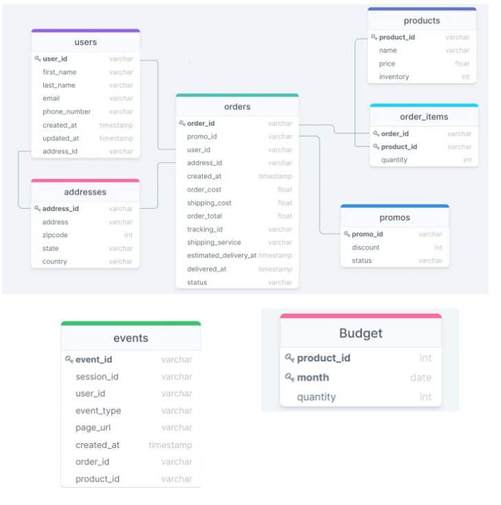

# Carga de datos

Bueno, ahora sí que sí, ha llegado el momento. Desde hace dos horas, una llamada del equipo de desarrollo ha provocado que tu equipo de datos parezca un avispero. Os acaban de comunicar que por fin, los datos de usuarios, productos, pedidos, etc... están disponibles para ser consumidos.

Eso si, para variar, no han sido muy claros en que datos vais a recibir ni tampoco su estructura. Os han dejado unos ficheros de muestra con datos para cada una de estas tablas, los cuales negocio está ansioso por poder visualizar y testear a través de la herramienta de BI antes de formalizar o entregar unos requisitos más elaborados. Por lo tanto lo que necesitamos es cargar estos datos en las tablas de Snowflake.

## Tu equipo te quiere (y nosotr@s también)

Tu equipo te proporciona información sobre la estructura de los datos y también los scripts de creación de las tablas. Además te detalla un poco más el proceso que deberías hacer. Aprende, porque en el futuro darán por supuesto que sabes crear un pipeline de datos desde cero y las diferentes etapas por las que debe de ir fluyendo el dato. 

### Diagrama de datos



### BBDD y tablas

Para empezar, creamos nuestra base de datos y un esquema:

```
create or replace database dev_curso_brz_db_alumno_**tu numero**;
```
```
create or replace schema bronze;
```

Creamos las siguientes tablas dentro de la bbdd y esquema anteriores: 

```

-- Create Events --
CREATE TABLE EVENTS(
	EVENT_ID VARCHAR(256),
	PAGE_URL VARCHAR(256),
	EVENT_TYPE VARCHAR(256),
	USER_ID VARCHAR(256),
	PRODUCT_ID VARCHAR(256),
	SESSION_ID VARCHAR(256),
	CREATED_AT VARCHAR(256),
	ORDER_ID VARCHAR(256)
);

-- Create ORDER_ITEMS --
CREATE TABLE ORDER_ITEMS(
	ORDER_ID VARCHAR(256),
	PRODUCT_ID VARCHAR(256),
	QUANTITY VARCHAR(256)
);

-- Create ORDERS --
CREATE TABLE ORDERS(
	ORDER_ID VARCHAR(256),
	SHIPPING_SERVICE VARCHAR(256),
	SHIPPING_COST VARCHAR(256),
	ADDRESS_ID VARCHAR(256),
	CREATED_AT VARCHAR(256),
	PROMO_ID VARCHAR(256),
	ESTIMATED_DELIVERY_AT VARCHAR(256),
	ORDER_COST VARCHAR(256),
	USER_ID VARCHAR(256),
	ORDER_TOTAL VARCHAR(256),
	DELIVERED_AT VARCHAR(256),
	TRACKING_ID VARCHAR(256),
	STATUS VARCHAR(256)
);

-- Create PRODUCTS --
CREATE TABLE PRODUCTS(
	PRODUCT_ID VARCHAR(256),
	PRICE VARCHAR(256),
	NAME VARCHAR(256),
	INVENTORY VARCHAR(256)
);

-- Create PROMOS --
CREATE TABLE PROMOS(
	PROMO_ID VARCHAR(256),
	DISCOUNT VARCHAR(256),
	STATUS VARCHAR(256)
);

-- Create Users --
CREATE TABLE USERS(
	USER_ID VARCHAR(256),
	UPDATED_AT VARCHAR(256),
	ADDRESS_ID VARCHAR(256),
	LAST_NAME VARCHAR(256),
	CREATED_AT VARCHAR(256),
	PHONE_NUMBER VARCHAR(256),
	TOTAL_ORDERS VARCHAR(256),
	FIRST_NAME VARCHAR(256),
	EMAIL VARCHAR(256)
);
```

## Proceso

### 1 - Creación de las tablas

Debes crearlas en el esquema **bronze** de tu base de datos. Recuerda que **la documentación** [Snowflake](https://docs.snowflake.com/) **es tu amiga**. 

### 2 - Carga de datos (Internal Stage)

Ahora cargar los datos de en las tablas de orders, events, order_items y users. Para ello, tu equipo ya te ha dejado los ficheros CSV en un internal stage llamado @bronze_stage (base de datos **CURSO_DATA_ENGINEERING_2026** y esquema **Bronze**).

**Importante**: ***A veces, las cosas no salen a la primera***. Recuerda, de nuevo, la documentación es TU AMIGA.

#### 2.1 - Investigación de Schema y creación de la tabla

¡Falta una tabla para cargar el fichero addresses.csv! Tendrás que ingeniártelas para conocer los campos de la tabla y hacer tú mismo el CREATE TABLE... (Puedes descagar los ficheros a tu local, consultar directamente el dato en el stage, etc...)

### 3 - Carga de datos (local - snowsql)

Cuando crees que ya está todo, te das cuenta que todavía faltan por cargar las tablas de products y la tabla de promos... Avisas a tu equipo, y te pasan los ficheros directamente para que los subas tú mismo, esta vez no serán ellos los que previamente los subirán al stage. 

- **products.csv**
- **promos.csv**

Tendrás que ingeniártelas para cargar crear un stage en el esquema bronze de tu base de datos, cargar los ficheros y posteriormente volcar sus datos en las tablas correspondientes.